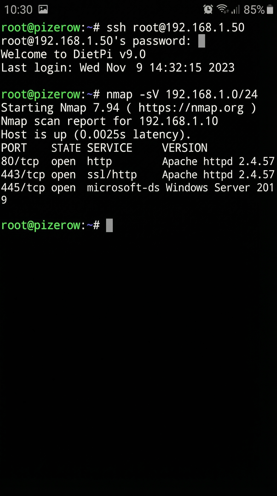

# 🛡️ Pi-Zero-Hybrid-Toolkit


[](LICENSE)
[](https://www.raspberrypi.org/)
[](https://dietpi.com/)

A versatile Red Team / Blue Team / AI Assistant toolkit for the Raspberry Pi Zero W. Built on DietPi with automated connectivity, self-healing WiFi, USB gadget mode, and comprehensive security tools—all controllable from your phone.

---

## 🚀 Key Features


**Triple Mode Operation** - Choose between Red Team (Attacker), Blue Team (Defender), or Tactical Assistant (AI Helper) modes at boot time.

**Self-Healing WiFi** - Background monitoring automatically reconnects if the network drops. Your Pi stays online even in unstable environments.

**USB Gadget Mode** - Access your Pi via USB Ethernet or Serial without WiFi. Just plug it into a computer.

**Phone Control** - Full web terminal accessible from any mobile browser. No SSH app required.

**LED Feedback** - Visual confirmation through programmed blink patterns when your Pi is online.

**AI Intelligence** - Tactical Assistant mode analyzes scan results and provides aggressive recommendations in real-time.

---

## 📊 System Architecture


The toolkit supports three operational modes that can work independently or together for complex scenarios.

---

## 🎯 Demo Screenshots

### Network Scanning (Termux Mobile)


### Wireless Attack (Kali Linux)


### Network Reconnaissance


### AI Tactical Assistant


---

## 🛠️ Installation

### What You Need
- Raspberry Pi Zero W
- MicroSD card (8GB minimum, 16GB recommended)
- [DietPi image](https://dietpi.com/) for Pi Zero W
- [BalenaEtcher](https://www.balena.io/etcher/)

### Quick Setup

**1. Flash DietPi** to your SD card using BalenaEtcher.

**2. Copy Scripts** from this repo to the `/boot` partition:
```
scripts/Automation_Custom_Script.sh
scripts/Automation_Custom_PreScript.sh
assistant/tactical_assistant.py → /boot/assistant/
```

**3. Configure WiFi** - Edit `dietpi-wifi.txt` on the boot partition:
```bash
aWIFI_SSID[0]='YOUR_WIFI_NAME'
aWIFI_KEY[0]='YOUR_PASSWORD'
```

**4. Select Mode** - Create an empty file on the boot partition:
- **Red Team** (default): No action needed
- **Blue Team**: Create file `mode_blue`
- **Tactical Assistant**: Create file `mode_assistant`

**5. Boot** - Insert SD card and power on. First boot takes 5-10 minutes.

**6. Verify** - Watch for 10 rapid LED blinks confirming connection. Check `my_ip.txt` on the SD card for the IP address.

---

## 📂 Included Tools

### 🔴 Red Team Mode
- **nmap** - Network exploration and security auditing
- **bettercap** - Complete network attack framework
- **aircrack-ng** - WiFi security auditing
- **tshark** - Network protocol analyzer
- **python3** - Scripting and exploit development

### 🔵 Blue Team Mode
- **fail2ban** - Intrusion prevention
- **snort** - Network intrusion detection
- **tcpdump** - Packet capture and analysis
- **iptables** - Advanced firewall management

### 🤖 Tactical Assistant Mode
- Analyzes scan results and identifies high-value targets
- Suggests exploit chains based on vulnerabilities
- Provides timing recommendations to avoid detection
- Logs intelligence to `assistant_intel.log`

---

## 🔑 Access & Login

**Default Credentials:**
- Username: `root`
- Password: `dietpi`

**Access Methods:**
- Web Terminal: `http://<pi-ip>:8080`
- Cockpit Dashboard: `http://<pi-ip>:9090`
- SSH: `ssh root@<pi-ip>`
- Hostname: `pizerow.local`

---

## ⚖️ Legal Notice

This toolkit is provided under the **MIT License**. By using this software, you agree:

- This is for **educational purposes and authorized testing only**
- You have **explicit permission** for any systems you test
- You assume **full responsibility** for your actions
- The developer is **not liable** for any misuse or damage

**Recommended:** Use only in **VM vs. VM** environments or dedicated security labs.

See [DISCLAIMER.md](DISCLAIMER.md) for complete legal terms.

---

## 📜 License

MIT License - See [LICENSE](LICENSE) for details.

---

**Made with 🛡️ for the security community**

*Use responsibly. Authorized testing only.*
